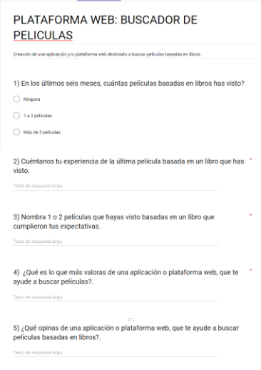

# Pelibooks

- Plataforma web responsive que ayuda a los fanáticos a la lectura y al cine a encontrar películas (información detallada) basadas en novelas.

## ¿Cómo nació la idea de Pelibooks?

- En nuestro país el porcentaje de lectores están en aumento (*); así mismo 8 de cada 10 personas usan internet para ver películas. Por ende nos encontramos frente a un grupo desatendido dentro del ámbito del entretenimiento y lectura; ya que son los lectores quienes desarrollan un actitud crítica y de búsqueda frente a los productos que consumen; y en muchas ocasiones han leido un libro luego de haber visto una película, o viceversa (**). Y así nació Pelibooks.

## Desarrollo de la idea

- **MARTES: 16/01/2017**

**Planificación, Organización y Ejecución**

1. Descubrimiento e investigación.
   + Búsqueda de información en la web.
   Herramientas utilizadas: Google chrome.
   Tiempo utilizado: 2 hrs.

2. Sintesis y definición (elección del tema).
   + Desarrollo y envío online de la encuesta: "Plataforma Web, buscador de películas".
   Herramientas utilizadas: Lluvia de ideas, entrevista presencial.
   Tiempo utilizado: 1 hr.

3. Ideación.
   + Sketch, prototipado inicial.
   + Análisis de la encuesta.
   + Repartición de las actividades a realizar.
     "Del total de encuestados, el 100% indicó que la idea de un buscador de peliculas basadas en libros, sería buena y/o genial."
   Herramientas utilizadas: Material de laboratoria (UX), pizarra acrílica, google chrome.
   Tiempo utilizado: 1 1/2 hr.

 **MIÉRCOLES: 16/01/2017**

**Planificación, Organización y Ejecución**
1. Feedback de los pendientes del día anterior.
   + Github, repositorio.
   + Readme, recolección de todas las evidencias.
   + Verificación del maquetado según tipo de vista.
   + Verificación de la funcionalidad según tipo de vista.

2. **Prototipado con correcciones**
   + Maquetado y funcionalidad de las diferentes vistas.

## Herramientas Utilizadas

- Html, para la estructura del contenido.
- Css, para darle estilo al contenido.
- Bootstrap
- The Open Movie Database (OMDb API)

## Fuente consultada

- [Laboratoria LMS] : https://laboratoria1.gitbooks.io/hackathon/content/

- [Bootstrap] : https://getbootstrap.com/docs/3.3/css/#forms

- [W3School] : https://www.w3schools.com/bootstrap/bootstrap_forms.asp

- OMDb API] : http://www.omdbapi.com/